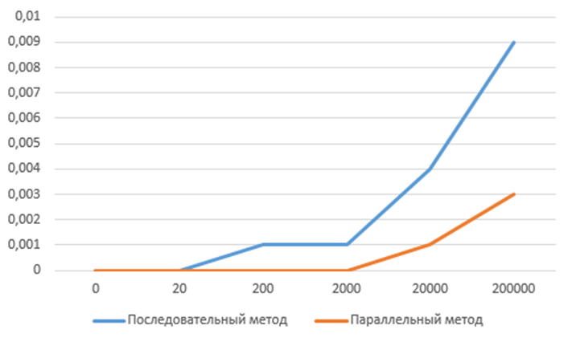

# Counting-non-matching-characters

## Описание

Приложение для подсчета несовпадающих символов.  Целью разработки рассматриваемой программы было сравнение алгоритмов последовательного и параллельного подсчета. Распараллеливание производилась с помщью следующих библиотек: [OpenMP](https://www.openmp.org/) и [MPI](https://www.mpi-forum.org/).

## Инструкция по подключению библиотек
Для подключения библиотеки openMP необходимо в файл конфигурации CMakeList.txt вствавить следующий код:
```
find_package(OpenMP)
if (OPENMP_FOUND)
    set (CMAKE_C_FLAGS "${CMAKE_C_FLAGS} ${OpenMP_C_FLAGS}")
    set (CMAKE_CXX_FLAGS "${CMAKE_CXX_FLAGS} ${OpenMP_CXX_FLAGS}")
    set (CMAKE_EXE_LINKER_FLAGS "${CMAKE_EXE_LINKER_FLAGS} ${OpenMP_EXE_LINKER_FLAGS}")
ENDIF()
```
Для подключения библиотеки MPI необходимо в файл конфигурации CMakeList.txt вствавить следующий код:
```
find_package(MPI REQUIRED)

target_link_libraries( PUBLIC MPI::MPI_CXX)
```
## Инструкция по сборке

Сборка проекта производится с помощью инструмента [CMake](https://cmake.org/). В терминале компьютера необходимо прописать следующие команды: 

```
cmake --build . --config Release --target main
```
## Теоретическая часть
Подсчёт числа несовпадающих символов двух текстовых строк s и p осуществляется попарным сравнением символов сравниваемых строк:
	Если ```s_i≠ p_i, 1≤i≤n```, то положить ```k=k+1```, 
где k, есть счётчик числа несовпадающих символов. Если при сравнении одна из сравниваемых строк оказывается короче другой, то в качестве недостающих символов можно рассматривать нулевой символ “\0”.
Возможным усложнением постановки может быть задача проверки совпадений текстовых файлов.
## Сравнение методов

